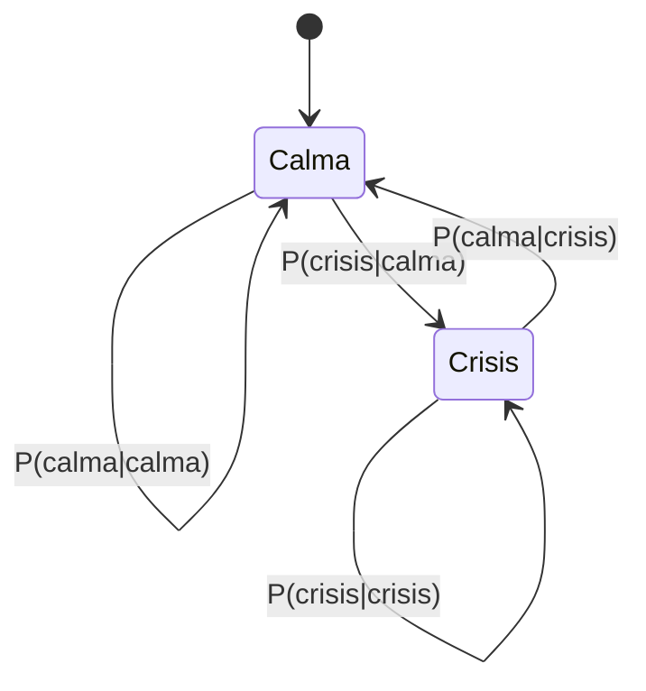
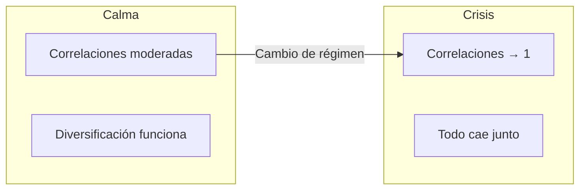
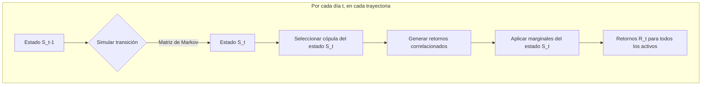

# Plan de Implementación: Práctica de Gestión de Riesgos
## Escenarios de Estrés y Cambios de Régimen de Mercado

> [!IMPORTANT]
> Este plan sigue un enfoque **incremental y didáctico**. Cada fase construye sobre la anterior, con validaciones intermedias para asegurar comprensión total del proceso.

---

## 1. Resumen del Proyecto

**Objetivo Principal**: Construir un motor de stress testing que:
1. Detecte regímenes de mercado (calma vs crisis) usando **Hidden Markov Models**
2. Capture dependencias extremas entre activos usando **Cópulas**
3. Simule escenarios realistas con **Monte Carlo**
4. Cuantifique riesgo extremo: **VaR 99%** y **Expected Shortfall (CVaR)**

**Cartera**: 18 activos equiponderados (sin rebalanceo):
- Acciones: AAPL, AMZN, BAC, BRK-B, CVX, ENPH, GME, GOOGL, JNJ, JPM, MSFT, NVDA, PG, XOM
- Oro: GLD
- Bonos: Treasury 10Y, Treasury 2Y, HYG (High Yield)

**Periodo de datos**: 01-01-2006 hasta la fecha actual

---

## 2. Estructura del Proyecto

```mermaid
graph TD
    A[PracticaGestionDeRiesgos/] --> B[notebooks/]
    A --> C[utils/]
    A --> D[data/]
    A --> E[docs/]
    A --> F[output/]
    
    B --> B1[main.ipynb - Notebook principal limpio]
    B --> B2[dev.ipynb - Notebook de desarrollo/pruebas]
    
    C --> C1[notebook_writer.py - Escribir celdas en notebooks]
    C --> C2[pdf_generator.py - Convertir MD a PDF]
    C --> C3[data_loader.py - Obtención y limpieza de datos]
    C --> C4[hmm_utils.py - Funciones para HMM]
    C --> C5[copula_utils.py - Funciones para cópulas]
    C --> C6[simulation.py - Motor Monte Carlo]
    C --> C7[risk_metrics.py - VaR, CVaR, drawdown]
    C --> C8[visualization.py - Gráficos estandarizados]
    
    D --> D1[raw/ - Datos crudos descargados]
    D --> D2[processed/ - Datos procesados]
    
    E --> E1[informe_ejecutivo.md - Informe para convertir a PDF]
    
    F --> F1[figures/ - Gráficos exportados]
    F --> F2[informe_ejecutivo.pdf - Entregable final]
```

---

## 3. Fases de Implementación

### Fase 0: Setup del Proyecto ⚙️

#### [NEW] [utils/](file:///c:/Users/raulr/Documents/MIAX/Practicas/PracticaGestionDeRiesgos/utils/)
Carpeta con módulos auxiliares

#### [NEW] [notebook_writer.py](file:///c:/Users/raulr/Documents/MIAX/Practicas/PracticaGestionDeRiesgos/utils/notebook_writer.py)
Script para escribir/modificar celdas en notebooks de Jupyter programáticamente.

#### [NEW] [pdf_generator.py](file:///c:/Users/raulr/Documents/MIAX/Practicas/PracticaGestionDeRiesgos/utils/pdf_generator.py)
Script para convertir Markdown a PDF (usando weasyprint o similar).

#### [NEW] [notebooks/main.ipynb](file:///c:/Users/raulr/Documents/MIAX/Practicas/PracticaGestionDeRiesgos/notebooks/main.ipynb)
Notebook principal con estructura/esqueleto de las 5 fases.

#### [NEW] [notebooks/dev.ipynb](file:///c:/Users/raulr/Documents/MIAX/Practicas/PracticaGestionDeRiesgos/notebooks/dev.ipynb)
Notebook de desarrollo donde probar código antes de incluirlo en main.

---

### Fase 1: Detección del Pulso del Mercado 💓

**Concepto Clave**: Los mercados tienen "estados ocultos" (Hidden States). Un HMM nos permite inferir en qué estado estamos aunque no lo observemos directamente.

**Tareas Técnicas**:
1. **Obtención de datos**: Descargar S&P 500 + todos los activos de la cartera
2. **Calcular retornos logarítmicos diarios**
3. **Ajustar HMM de 2 estados** usando `hmmlearn.GaussianHMM`
4. **Extraer matriz de transición**: Probabilidades de cambio de estado
5. **Visualización**: S&P 500 coloreado por régimen

**Output esperado**:
- Gráfico S&P 500 con zonas coloreadas (blanco=calma, azul=crisis)
- Matriz de transición interpretada (p.ej., "en crisis, 95% de probabilidad de seguir en crisis")

---

### Fase 2: Anatomía del Riesgo 📊

**Concepto Clave**: Las distribuciones de retornos cambian entre regímenes. En crisis: mayor volatilidad, colas más pesadas, correlaciones más altas.

**Tareas Técnicas**:
1. Segmentar datos por estado (calma vs crisis)
2. Calcular para cada activo y cada estado:
   - Media (μ)
   - Volatilidad (σ)
   - Skewness (asimetría)
   - Kurtosis (colas pesadas)
3. Crear tabla comparativa
4. Análisis específico: HYG y GLD

**Preguntas a responder**:
- ¿Cuánto aumenta la volatilidad del High Yield (HYG) en crisis?
- ¿El oro (GLD) sigue siendo refugio? (¿baja correlación/sube en crisis?)

---

### Fase 3: Cuando la Diversificación Falla 🔗

**Concepto Clave**: Las cópulas capturan la estructura de dependencia entre activos, especialmente en las colas de la distribución.

**Tareas Técnicas**:
1. Calcular matriz de correlación de Pearson por estado
2. Transformar datos a uniformes (para ajuste de cópulas)
3. Ajustar cópulas (Gaussian, t-Student, Clayton, Gumbel) por estado
4. Comparar parámetros de dependencia
5. Visualización: heatmaps de correlación comparativos

---

### Fase 4: Motor de Simulación 🎰

**Concepto Clave**: Monte Carlo genera "futuros posibles" respetando la dinámica de regímenes y las dependencias entre activos.

**Tareas Técnicas**:
1. Implementar simulador de cadena de Markov
2. Implementar muestreo de cópulas
3. Transformar de uniformes a retornos reales
4. Generar 10,000 trayectorias × 126 días (6 meses)

**Validación (crítica)**:
- **Test A**: Wealth index simulado vs real
- **Test B**: % días por estado, duración media de estados
- **Test C**: Volatilidad, max drawdown, VaR 99%, CVaR 99%

---

### Fase 5: Escenarios de Estrés 💥

**Concepto Clave**: "Romper la cartera" = forzar condiciones extremas pero económicamente coherentes.

**Escenario 1: Estanflación 2022**
- Alta inflación + bajo crecimiento
- Acciones y bonos caen simultáneamente
- Implementación: Forzar estado "crisis" con ajustes a parámetros

**Escenario 2: Crisis Crediticia 2008**
- Colapso de crédito, contagio sistémico
- High Yield (HYG) y financieras (BAC, JPM) especialmente afectados
- Implementación: Calibrar con datos de 2008-2009

**Escenario 3: [Propuesto por el estudiante]**
- Opciones: Crisis energética, crash tecnológico, guerra/geopolítico
- Debe tener justificación económica clara

**Métricas a reportar por escenario**:
- VaR 99% (diario y 6 meses)
- Expected Shortfall / CVaR 99%
- Comparativa vs escenario base

---

## 4. Plan de Documentación 📚

### Notebook Técnico
Cada celda debe incluir:
- **Comentarios en markdown** explicando el "por qué"
- **Comentarios en código** explicando el "cómo"
- **Gráficos interpretativos** con títulos y leyendas claras

### Informe Ejecutivo (3 páginas máx.)
1. **Página 1**: Contexto y enfoque metodológico
2. **Página 2**: Hallazgos principales (cambio de régimen, correlaciones)
3. **Página 3**: Resultados de escenarios y recomendaciones

---

## 5. Librerías Principales

| Librería | Propósito |
|----------|-----------|
| `yfinance` | Descarga de datos de mercado |
| `pandas`, `numpy` | Manipulación de datos |
| `hmmlearn` | Hidden Markov Models |
| `scipy.stats` | Distribuciones y estadísticos |
| `copulas` / `pyvinecopulib` | Ajuste de cópulas |
| `matplotlib`, `seaborn` | Visualización |
| `weasyprint` / `pdfkit` | Generación de PDF |

---

## 6. Próximos Pasos Inmediatos

> [!NOTE]
> Empezamos con la **Fase 0** para establecer la infraestructura base antes de cualquier análisis.

1. ✅ Crear estructura de carpetas
2. ✅ Crear `notebook_writer.py` (para escribir en notebooks)
3. ✅ Crear `pdf_generator.py` (para convertir MD a PDF)
4. ✅ Crear esqueleto de `main.ipynb` con las 5 fases vacías
5. ✅ Crear `dev.ipynb` vacío para pruebas

---

## User Review Required

> [!IMPORTANT]
> **Decisiones que requieren tu aprobación:**
>
> 1. **Fuente de datos**: ¿Usamos `yfinance` para descargar datos? Es gratuito y disponible, pero puede tener limitaciones. ¿Tienes otra preferencia?
>
> 2. **Librería de cópulas**: Hay varias opciones (`copulas`, `pyvinecopulib`, implementación manual). ¿Alguna preferencia o requisito del profesor?
>
> 3. **Generación de PDF**: `weasyprint` es bastante robusto. ¿Lo instalamos o tienes otra preferencia?
>
> 4. **¿Empezamos con la Fase 0 (setup) ahora mismo?**

